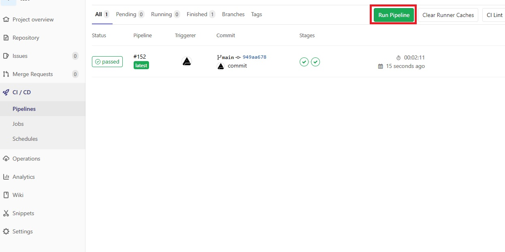
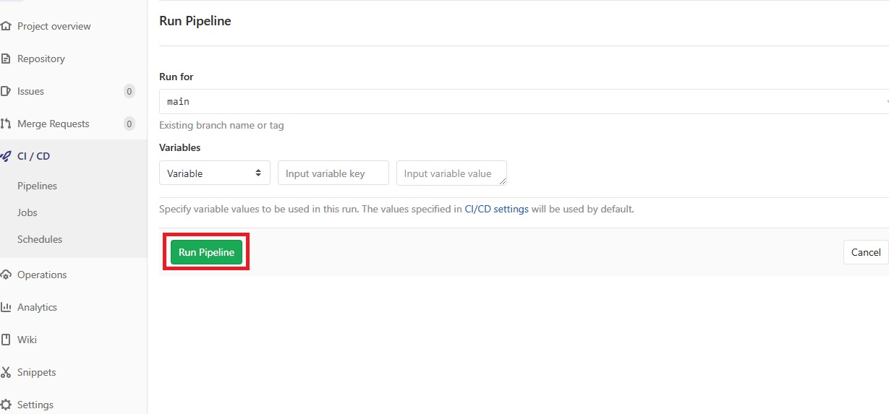

# build-dockerfile-using-runner-in-gitlab

[](https://github.com/RichardLitt/standard-readme)

build dockerfile using Runner in GitLab.(This project uses .Net Core as an example.)

## Table of Contents

- [Install](#install)
- [Usage](#usage)
- [Maintainers](#maintainers)
- [Contributing](#contributing)
- [License](#license)

## Install
Before starting, a **Docker** must be installed.
### Install GitLab-Runner
```bash
$ ssh -p [port] [user]@url
# Create container
$ sudo docker run -d \
--name [container-name] \
--restart always \
--volume /var/run/docker.sock:/var/run/docker.sock \
gitlab/gitlab-runner:latest
$ sudo docker exec -it [container-name] bash
# Registry GitLab-Runner
$ gitlab-runner register -n \
--url "[url]" \
--registration-token "[token]" \
--description "[description]" \
--executor docker \
--docker-image "docker:18.09.8" \
--docker-volumes /var/run/docker.sock:/var/run/docker.sock
```
### Upload project
```bash
$ git clone https://github.com/zxc010613/build-dockerfile-using-runner-in-gitlab.git
$ cd build-dockerfile-using-runner-in-gitlab
$ git remote set-url origin [gitlab-project]
$ git push origin master
```
## Usage



## Maintainers

[@zxc010613](https://github.com/zxc010613)

## Contributing
PRs accepted.

## License
[MIT](./LICENSE)
